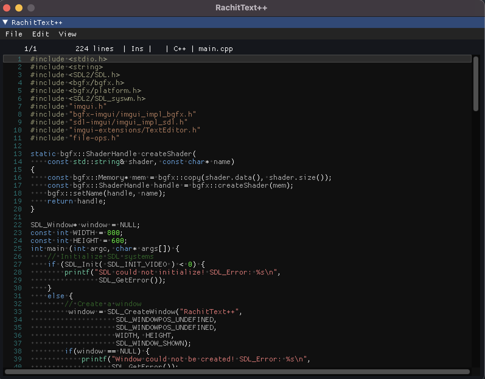

# RachitText++
Simple, lightweight, open-source text editor built on top of imgui, SDL2, and 
bgfx. Currently in development, and will be for a while as I have many other projects
to wrap up.

# To-do
When I do revisit this project, I plan to add:
- The ability to open files with a file browser & command line
- Auto detect language based on file type
- Flesh out README
- Build for macOS and windows and create a release